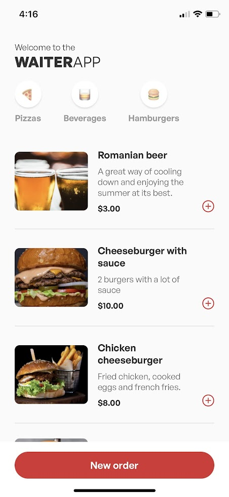
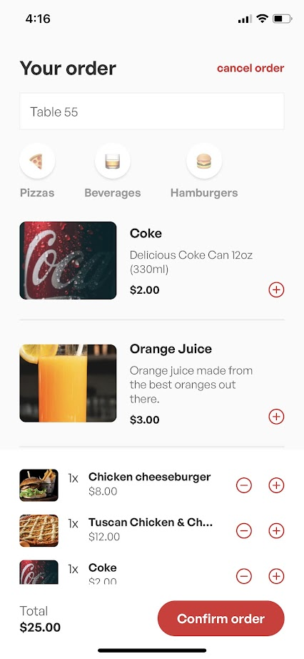
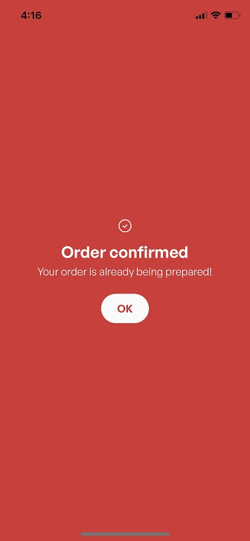
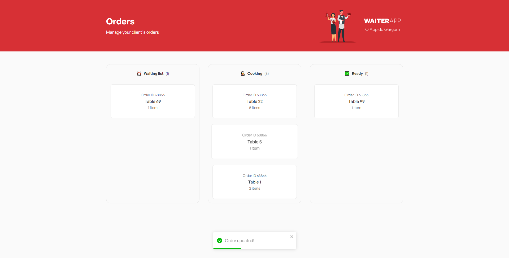

<h3 align="center">
  <div align="center">
    
  </div>
  <br><br>
  <br>
</h3>

<p>WaiterAPP it's the application for the restaurants owners. Developed to make your life easier and manage your client's orders.</p>

<div align="center" style="display: flex">
  
  
  
</div>

# Index

- [About](#about)
- [Functionalities](#functionalities)
- [Technologies](#technologies)
- [Fixed and upgrades](#fixed-and-upgraded)
- [How to use](#how-to-use)

<a id="about"></a>

## :bookmark: About

`Garçom` means waiter in brazillian portuguese, this app helps you manage just that, install this app in your waiter's phone or just use a QR Code to get your client to install it.

<b>Two apps in one</b>
In your kitchen you have a dashboard with all the orders made by the mobile app, handle then as you like. Orders come by default in the WAITING state, then you can assign them to the cooking area or the done area.

<b>The Mobile APP</b>
The heart of this application is the mobile, browse through all the available products, filter by category, add to cart and then send your order to the kitchen, then a Chef can only worry about making your food tasty


<a id="functionalities"></a>

## :fire: Functionalities

- ### **Dashboard**

  - List all orders from the mobile app.
  - See order status.
  - Change order status to either cooking or done.
  - Cancel/delete orders. 

- ### **Mobile App**

  - Browse and shop all the available items in the restaurant.
  - Filter items by category.
  - Select your current table.
  - Add items to your cart and get the total price and summary of your order.
  - Remove items from your cart
  - Send orders to the kitchen to cook.

<a id="technologies"></a>



## :rocket: Technologies

The project is made with:


- [React](https://reactjs.org/)
- [React Native](https://reactnative.dev/)
- [Node.js](https://nodejs.org/en/)
- [Mongoose](https://mongoosejs.com/)
- [MongoDB](https://mongodb.com/)
- [TypeScript](https://www.typescriptlang.org/)
- [Express](https://expressjs.com/)
- [Dotenv](https://www.npmjs.com/package/dotenv)

<a id="fixed-and-upgraded"></a>
## ✨ Fixed and upgrades

This project is fully developed and properly working but it could have some changes:

- [x] Socket IO Implementation
- [x] Expo and React Native best practices
- [x] Awesome design
- [x] Publishing to the application stores
- [ ] Creating products and categories via PC dashboard
- [ ] Watch status of your order via mobile app

<a id="how-to-use"></a>

## :fire: How to Use
- ### **Dependencies**

  - Is **required** to install **[Node.js](https://nodejs.org/en/)**
  - Is **required** to install **[Expo](https://expo.dev//)**
  - In order to run scripts and install dependencies you need to install a **package manager**, like i'm using yarn.

1. First step, clone this github repository:

```sh
  $ git clone https://github.com/lamongabrie/waiter-app.git
```

2. You need a mongoDB instance running your local machine, either install **[MongoDB community](https://www.mongodb.com/try/download/community)** and run it or as i prefer use **[Docker](https://www.docker.com/)**.

Docker example:

```sh
$ docker run -d -p 27017:27017 --name mongo_db_waiterapp mongo
```

3. Now go to the API folder

```sh
$ cd /waiter-app/

$ cd /server/
```

4. Seed your freshly made database. As you can imagine, you need products, categories and orders to properly understand the functioning of the app. This seed does just that:

```sh
$ seed -u mongodb://127.0.0.1:27017/waiterapp --drop-database ./src/database/seeds/data
```
<small>you may need to change the mongo url to your device's local db url.</small>

6. Please check the mobile and web libs folder, make sure the BASEURL is set to your local IP, so it can connect to the api running in your pc.

```sh
$ cd ../

# Mobile
$ cd mobile

# Dashboard web
$ cd web

# Then go to /lib/api.ts
```

5. Now just run the server
```sh
$ yarn dev
```

7. Make sure the api is running then is just running the mobile apps
```sh
# Mobile
$ cd mobile
$ yarn start

# Dashboard web
$ cd web
$ yarn dev
```